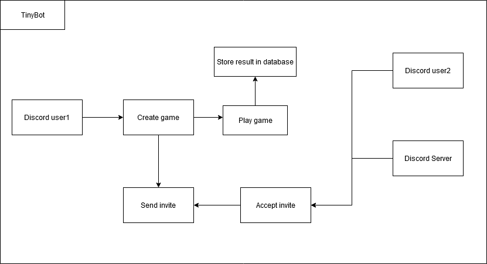

# TinyBot

## Project Abstract
The project that I am proposing is a stand-alone project. TinyBot is a discord bot that will be used by the users to play minigames with eachother. The player will be able 
to invite each other to play using their private messages or in their servers for everyone to spectate or to share the results. The user will also be ableto create an open 
challenge that any members of the server could accept and play against. The games that will be implemented are tic-tac-toe, sudoku, battleship, connect 4, and more. The bot 
will also have a database that will store the score so that the users will be able to check their game history to see how many games they have won against other users. 

## Project Relevance
TinyBot meets a lot of key educational goals. This project would cover topics such as test driven development, UML, debugging, graphic user interface, access to database, design patterns,
and code profiling and optimization. We will also meet the practical experience in using modern software development tools using project management, test, and issue tracking on Github.

## Conceptual Design
It is still a work in progress in my mind but so far I have planned to create the whole discord bot obviously. There will be couple of features that will be implemented such as multiple 
games as mentioned in abstraction, the user picking a game and creating an invite, the challenger accepting the invite which will link the two and start the game, each user will take 
turns to make their move, once the game is over the result will be recorded on the data to view later by the users. I am also planning to create a leaderboard specific to each server 
that will keep track of who has won the most games within that server and so on. 

## Background

***Building***
- Will be written in python and JavaScript
- Corporate Python and JavaScript using pyjs
- Need a Discord Developers account
- Need to create a bot on discord first then code it.
- Need to create a discord server to test the bot

**Running**
- You can run and test it by creating a server and adding the bot on the server
- You can also use the website called repl.it which is an online ide as well as a hosting service which can also be used to run our code.	

## Required Resources
Discord, VScode
